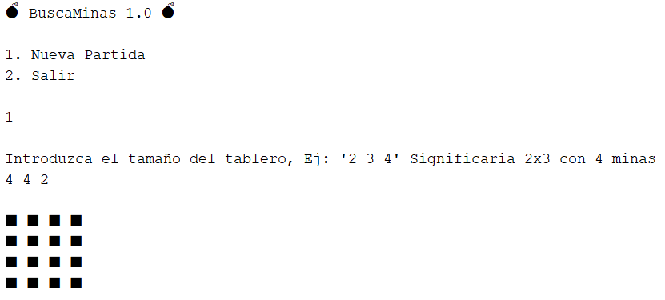
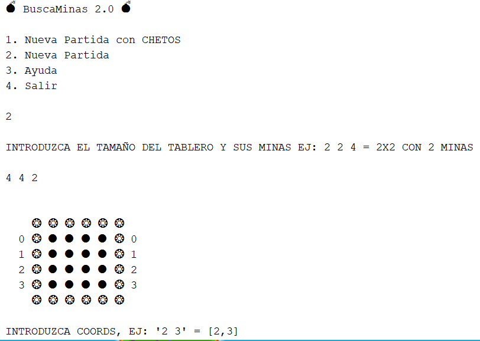
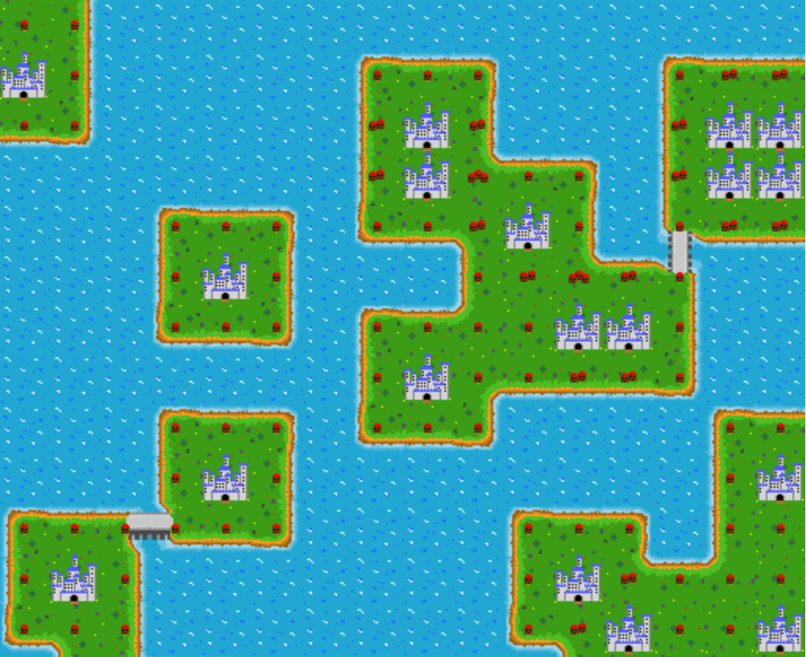
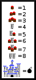

# **Island Minesweeper**

Interactive minesweeper game 💣 with a beautiful island theme 🏝️ and castles 🏰

## **Table of contents**

- [**Island Minesweeper**](#island-minesweeper)
  - [**Table of contents**](#table-of-contents)
  - [**General info**](#general-info)
  - [**Demo**](#demo)
  - [**Screenshots**](#screenshots)
  - [**Technologies**](#technologies)
  - [**Setup**](#setup)
  - [**Usage**](#usage)
  - [**Status**](#status)
  - [**Contact**](#contact)

## **General info**

**Date**: January, 2019  
**Duration**: 1 Month.

It was a deliverable practice of doing a basic minesweeper in console with **Java**, but after doing so, I have continued to improve the project by releasing a version 2.0 with its own algorithm and leaving it nice to play on the console with the full functionality of the minesweeper and later I wanted to pass that project to version 3.0 using JavaFx and further improving this algorithm and becoming my first complex project in this framework.

In version 3.0 I have wasted a lot of time designing each tile pixel by pixel myself. Since I have finally finished designing 34 different tiles. Finally, I was surprised how the final design could fit, giving a different theme to a game as simple as the minesweeper.

## **Demo**

You can try it downloading the [**Jar**](https://github.com/udsgit/island-minesweeper/raw/master/dist/J3Emmanuel.jar).

> <br><i>Demo</i>

## **Screenshots**

> 
> 
> <br><i>Example of the evolution of the project, from version 1.0 to 3.0.</i>

## **Technologies**

- **Java**
- **Java Fx**&nbsp;&nbsp;_(for 3.0 version)_

## **Setup**

1. Clone or download the repository.

```console
git clone https://github.com/udsgit/island-minesweeper.git
```

2. Open project with your **IDE** (In my case I used NetBeans).
3. Done, you can run it from there.

## **Usage**

1. Just download and install the [**Jar**](https://github.com/udsgit/island-minesweeper/raw/master/dist/J3Emmanuel.jar) or if you have cloned it, you can run it from the same IDE when compiling it.
2. When you run it, a menu will appear to choose the number of rows, columns and mines that the board will have.
3. When the board is generated, you can uncover each tile with the left mouse button or using the right mouse button to mark the possible bombs, doubts or unmark them.
4. Check the legend.

> <br><i>Legend</i>

5. Enjoy.

## **Status**

Project is: **_Completed._**

Because the game is functional and after having gone through 3 different versions I consider the project completed.

## **Contact**

Created by [@Emmanuel](https://www.linkedin.com/in/emagleza/), feel free to contact me!
